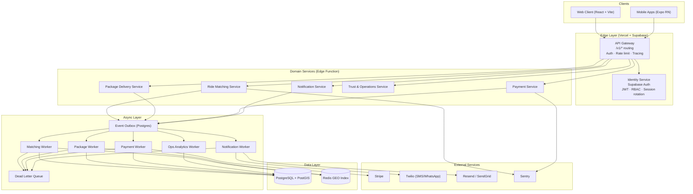

# Wasel Platform

Wasel is a corridor-based mobility and logistics platform for shared rides, package handoff delivery, and transport coordination — built for the Jordan and Iraq markets.

The system is designed around **event-driven domain contracts**, with a Supabase Edge Function runtime, typed service topology, horizontally scalable workers, and strict bounded-context separation.

---

## Quick Start

```bash
# Install dependencies
npm install

# Start local dev stack (Supabase + Vite)
docker-compose -f docker-compose.dev.yml up
npm run dev

# Run all checks
npm run type-check && npm run lint && npm run test:unit && npm run build
```

Required env vars — copy `.env.example` and fill in:

```bash
VITE_SUPABASE_URL=
VITE_SUPABASE_ANON_KEY=
VITE_EDGE_FUNCTION_NAME=make-server-0b1f4071
VITE_APP_URL=https://www.wasel14.online
```

See [docs/WIRING_ARCHITECTURE.md](docs/WIRING_ARCHITECTURE.md) for the full environment reference.

---

## System Philosophy

- **Event-driven domain contracts** — all core workflows are modeled as typed domain events; the queue contract is the source of truth for worker ownership and retry policy
- **Service isolation** — each bounded context owns its data and execution logic; no cross-service direct database coupling
- **Stateless compute** — services are horizontally scalable; workers handle async processing independently
- **Contract-first integration** — all service communication is schema-driven via OpenAPI and typed queue contracts; breaking changes are explicitly versioned
- **Operational visibility by default** — structured logging, Sentry error capture, App Insights metrics, and SLO-driven alerting are embedded at service level

---

## Architecture Overview

### Runtime shape

The production runtime is a **React SPA (Vercel) + Supabase Edge Function (Deno)**. The internal contracts reflect full microservice boundaries, but the current deployment model uses a single edge function for operational simplicity. The Kubernetes manifests under `infra/k8s-draft/` represent the target scale-out topology.



---

## Bounded Contexts

| Context | Service | Worker | Data Store | SLO |
|---|---|---|---|---|
| Identity | identity-service | — | Postgres | 99.95%, p95 < 200ms |
| Rides | ride-matching-service | matching-worker | Postgres + PostGIS + Redis GEO | 99.9%, p95 < 700ms |
| Packages | package-delivery-service | package-worker | Postgres + PostGIS + Redis GEO | 99.9%, p95 < 400ms, freshness < 5s |
| Payments | payment-service | payment-worker | Postgres + Stripe | 99.95%, p95 < 350ms |
| Communications | notification-service | notification-worker | Postgres + Twilio + Resend | 99.9%, freshness < 2s |
| Operations | trust-service | ops-worker | Postgres | 99.5%, freshness < 5m |

Full SLO sheet: [docs/reliability-slos.md](docs/reliability-slos.md)

---

## Domain Lifecycles

### Ride

```
requested → matched → accepted → in_progress → completed
                ↘                      ↘
              cancelled             cancelled
```

Source: [`src/domain/rides/lifecycle.ts`](src/domain/rides/lifecycle.ts)

### Package

```
created → assigned → picked_up → in_transit → delivered
    ↘          ↘          ↘           ↘
  cancelled  cancelled  cancelled  cancelled
```

Source: [`src/domain/packages/lifecycle.ts`](src/domain/packages/lifecycle.ts)

### Driver availability

```
offline → available → reserved → on_trip → cooldown → available
              ↘           ↘
            offline     offline
```

Source: [`src/domain/drivers/availability.ts`](src/domain/drivers/availability.ts)

---

## Event & Queue Contracts

All domain events are typed in [`src/domain/events.ts`](src/domain/events.ts). Queue ownership, retry policy, and DLQ routing are defined in [`src/platform/queue-contracts.ts`](src/platform/queue-contracts.ts).

| Topic | Owner Worker | Retry | DLQ |
|---|---|---|---|
| `rides.requested` | matching-worker | 5× exponential | `rides.requested.dlq` |
| `rides.assigned` | notification-worker | 5× exponential | `rides.assigned.dlq` |
| `rides.completed` | ops-worker | 3× fixed | `rides.completed.dlq` |
| `packages.created` | package-worker | 5× exponential | `packages.created.dlq` |
| `packages.location-updated` | package-worker | 3× fixed | `packages.location-updated.dlq` |
| `packages.delivered` | notification-worker | 5× exponential | `packages.delivered.dlq` |
| `payments.authorized` | payment-worker | 5× exponential | `payments.authorized.dlq` |
| `payments.captured` | ops-worker | 3× fixed | `payments.captured.dlq` |
| `notifications.dispatch` | notification-worker | 8× exponential | `notifications.dispatch.dlq` |

Every dead-letter message carries the original `traceId` and entity ID for replay. The health endpoint at `GET /v1/health` exposes `broker.deadLetterCount`.

---

## API Contract

All endpoints are versioned under `/v1/` and return a standard envelope:

```json
{
  "success": true,
  "data": { "id": "ride_123" },
  "metadata": {
    "requestId": "req_123",
    "traceId": "trace_abc",
    "timestamp": "2026-04-30T19:00:00.000Z",
    "version": "v1"
  }
}
```

Full OpenAPI spec: [`docs/openapi/wasel-v1.yaml`](docs/openapi/wasel-v1.yaml)
API contract reference: [`docs/api-contract.md`](docs/api-contract.md)

---

## Security

- **Identity**: Supabase Auth — JWT with 1h expiry, refresh-token rotation, httpOnly cookies in production
- **RBAC**: `admin`, `operator`, `driver`, `user` — enforced at gateway and service boundary via [`src/platform/rbac.ts`](src/platform/rbac.ts)
- **RLS**: Row-level security policies on all Postgres tables — `supabase/migrations/`
- **Secrets**: `VITE_*` prefix enforced for client-safe vars; server-only secrets never enter the browser bundle; validated by `scripts/check-env-exposure.mjs`
- **Abuse controls**: Gateway rate limiting, CSRF protection on mutations, throttled geo updates via [`src/platform/geo-stream.ts`](src/platform/geo-stream.ts)
- **Static delivery**: CSP, HSTS, permissions policy, cross-origin hardening — [`docker/nginx.conf`](docker/nginx.conf)
- **Secret scanning**: `.gitleaks.toml` + CI `secret-scan` job on every push

Full threat model: [docs/security-and-identity.md](docs/security-and-identity.md)

---

## Observability

| Signal | Tool | Source |
|---|---|---|
| Runtime errors | Sentry | `src/utils/monitoring.ts` |
| Client metrics | App Insights | `src/utils/appInsights.ts` |
| Structured logging | Custom helper | `src/platform/observability.ts` |
| Grafana dashboard | Wasel Overview | `.github/workflows/grafana-dashboard-wasel-overview.json` |
| Uptime + DLQ health | `GET /v1/health` | Returns `broker.outboxPending` + `broker.deadLetterCount` |

Golden signals, alert thresholds, and trace model: [docs/observability.md](docs/observability.md)
SLO targets and error-budget rules: [docs/reliability-slos.md](docs/reliability-slos.md)

---

## Testing

| Layer | Tool | Command |
|---|---|---|
| Unit | Vitest | `npm run test:unit` |
| Integration | Vitest | `npm run test:unit -- tests/integration` |
| E2E | Playwright | `npm run test:e2e` |
| Mobile E2E | Detox | `cd mobile && npx detox test` |
| Load — smoke | k6 | `npm run test:load:smoke` |
| Load — realistic | k6 | `npm run test:load:realistic` |
| Load — soak (60m) | k6 | `npm run test:load:soak` |
| Load — production | k6 | `npm run test:load:production` |
| Contract | Vitest | `npm run test:unit -- tests/unit/queue-contracts.test.ts` |

Coverage thresholds: branches 75%, functions 80%, lines 85%.
Full testing guide: [docs/testing.md](docs/testing.md)

---

## Scaling Roadmap

| Stage | MAU | Key changes |
|---|---|---|
| Current | < 10k | Single edge function, Supabase managed, one region |
| Next | 10k – 100k | Dedicated queue infra, split workers, Redis GEO, formalized rate limiting |
| Regional | 100k – 1M | Separate service ownership per bounded context, autoscaled matching fleet, regional failover, replayable event streams |

Full tradeoff analysis: [docs/scaling-and-tradeoffs.md](docs/scaling-and-tradeoffs.md)

---

## Repository Map

```
src/
  domain/          # Canonical state machines and typed domain events
  platform/        # Event bus, RBAC, queue contracts, service topology, observability
  features/        # Route-level user experiences
  services/        # Backend-facing orchestration and business workflows
  components/      # UI component library (wasel-ui, wasel-ds)
  locales/         # i18n chunks (AR + EN)
supabase/
  functions/       # Edge function handlers (Deno)
  migrations/      # Postgres + PostGIS migration history with rollbacks
  seeds/           # Mock engine launch pack
infra/
  k8s-draft/       # Kubernetes manifests (target scale-out topology)
  redis/           # Redis config
mobile/
  src/             # React Native (Expo SDK 51) mobile client
docs/              # Architecture, API contract, runbooks, SLOs, security
tests/             # Unit, integration, E2E, load
```

---

## Documentation Index

| Doc | Purpose |
|---|---|
| [docs/architecture.md](docs/architecture.md) | Actual production architecture and bounded contexts |
| [docs/api-contract.md](docs/api-contract.md) | API versioning, envelope, and service surface |
| [docs/openapi/wasel-v1.yaml](docs/openapi/wasel-v1.yaml) | OpenAPI 3.1 spec |
| [docs/workers-and-queues.md](docs/workers-and-queues.md) | Worker ownership and async topology |
| [docs/observability.md](docs/observability.md) | Golden signals, alert thresholds, trace model |
| [docs/reliability-slos.md](docs/reliability-slos.md) | SLO targets and error-budget rules |
| [docs/security-and-identity.md](docs/security-and-identity.md) | Identity model, RBAC, RLS, threat model |
| [docs/scaling-and-tradeoffs.md](docs/scaling-and-tradeoffs.md) | Scaling tiers and intentional tradeoffs |
| [docs/PRODUCTION_RUNBOOK.md](docs/PRODUCTION_RUNBOOK.md) | Incident response, rollback, maintenance |
| [docs/WIRING_ARCHITECTURE.md](docs/WIRING_ARCHITECTURE.md) | Connection points, fallback strategy, env config |
| [docs/testing.md](docs/testing.md) | Testing strategy and coverage requirements |
| [ENGINEERING_STANDARDS.md](ENGINEERING_STANDARDS.md) | Code quality, TypeScript, git workflow |
